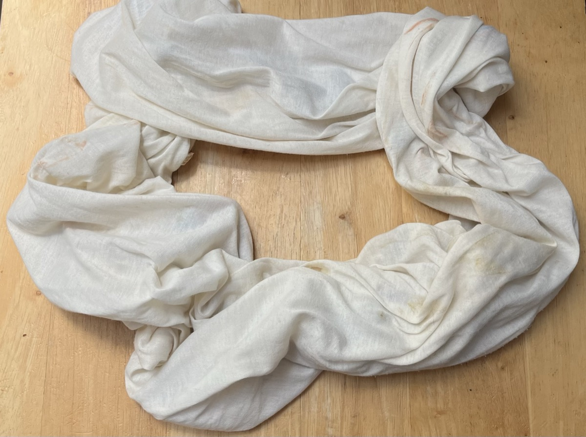
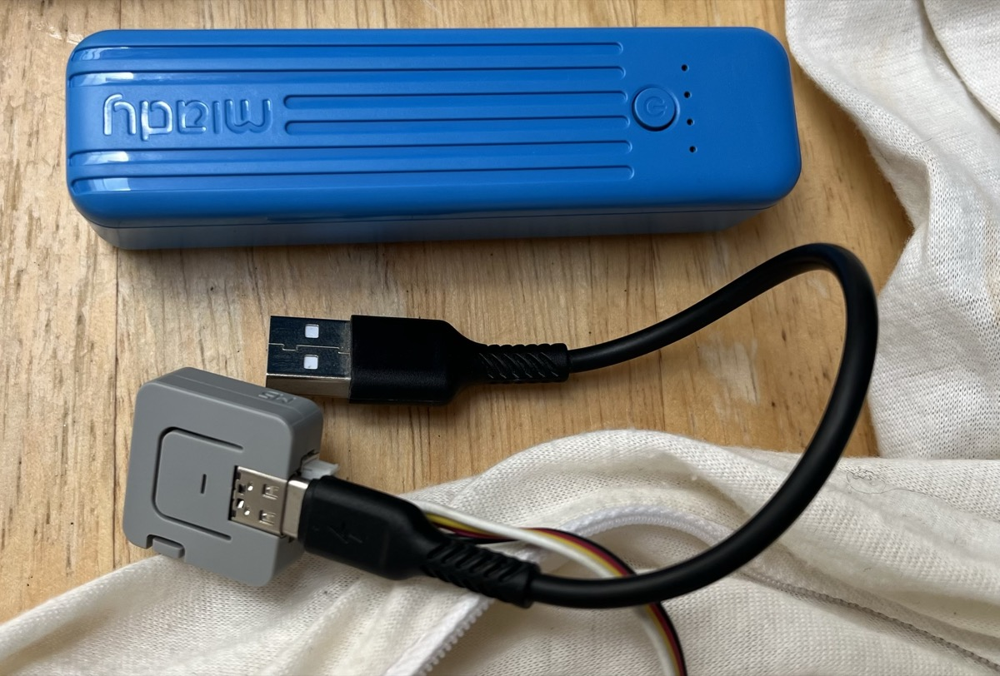
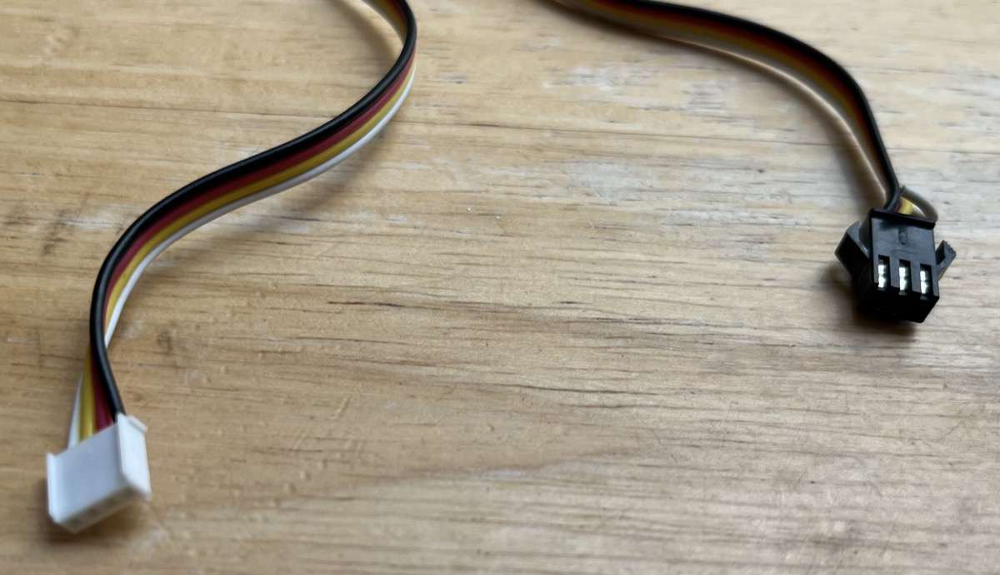
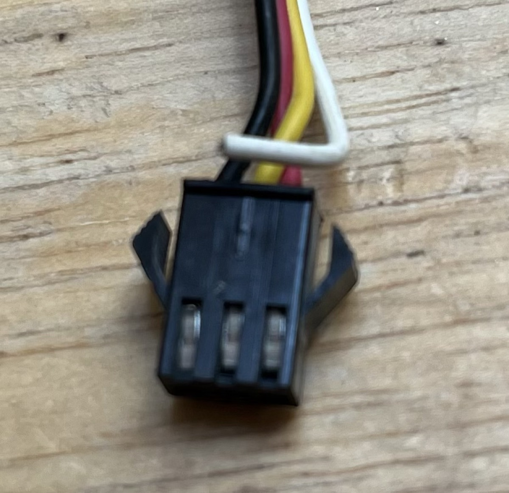
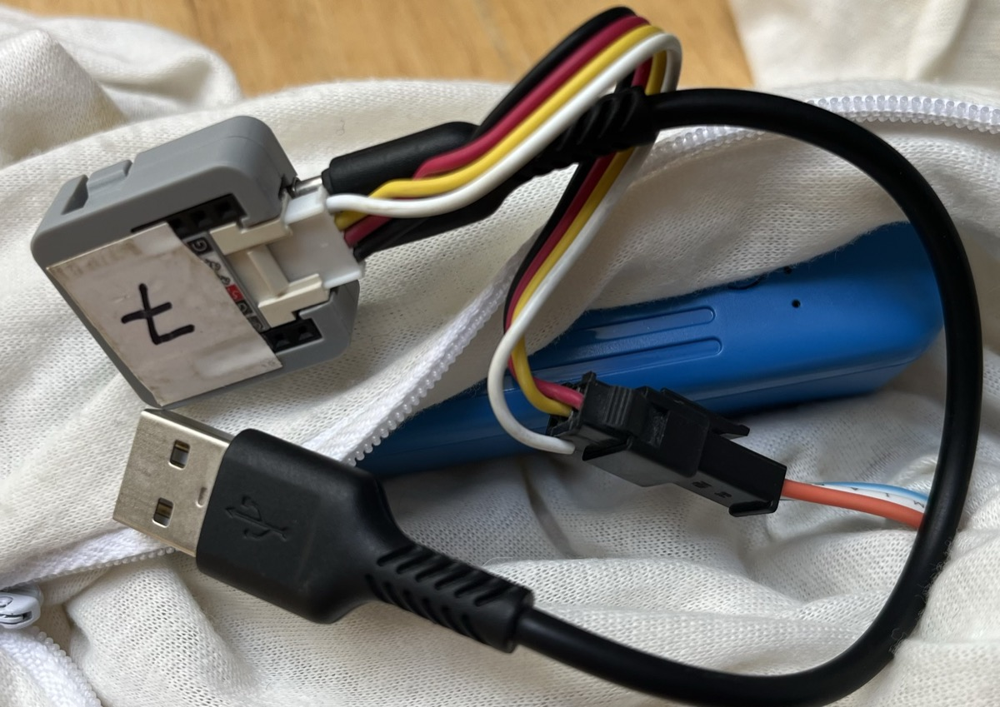

# Scarfnet

ESP32-based (M5Stack Atom Lite) firmware that coordinates LED patterns across a mesh network of wearable scarves. Each scarf node runs the same firmware and uses painlessMesh (WiFi mesh) to synchronize button presses and LED animations in real time.

## Prerequisites

- [PlatformIO](https://platformio.org/) (CLI or VS Code extension)
- [uv](https://docs.astral.sh/uv/) for Python tooling

## Hardware

One complete scarf node requires the following:



### Controller

[ATOM Lite ESP32 IoT Development Kit](https://shop.m5stack.com/products/atom-lite-esp32-development-kit)

This is the core of Scarfnet. 

Any ESP32 controller will work, but if you do not use this specific controller, then your IO pins and button may be on a separate GPIO and thus might require custom Scarfnet firmware for your unit. And if that is the case, then you won't be able to use OTA updating from other scarves in the future. So just use this one.



### Battery

Any small ~5000mAh USB battery pack works. Tested with:
[SIXTHGU Portable Charger](https://www.amazon.com/dp/B0FJG8YKQH)

I recommend getting them anywhere except Amazon if at all possible.

The battery connects to the USB-C port on the controller via a short USB-A or USB-C cable. Smaller is better — everything needs to fit in the scarf's zippered pocket.

### Cable (controller → LEDs)

We will be creating an custom 4-pin Unbuckled Grove to 3-pin JST-SM 2.5mm cable. This is the trickiest part of the whole product. If you are friends with the Scarfnet creator, it may be best to just ask him to create one for you.

[Unbuckled Grove Cable](https://shop.m5stack.com/products/4pin-buckled-grove-cable) — get a short length for a standard scarf, or longer if adapting to a different form factor.

You'll cut this cable in half and terminate one end with a JST-SM connector to match the LED strip's input connector.

For the JST-SM connector side, two options depending on your comfort with crimping or soldering:

- **Bare un-crimped connectors** (cleanest result, but requires a crimping tool):
  [JST SM 2.5 mm Pitch 3-Pin Electronic Connectors](https://www.amazon.com/dp/B085RC16VK)
  You'll also need a JST-compatible crimper to terminate the wires.
- **Pre-crimped connectors** (easier — just solder and cover):
  [3-pin JST SM Plug + Receptacle Cable Set](https://www.adafruit.com/product/1663)
  You'll need a soldering iron and heat shrink tubing to protect each joint.




### LED Strip

For the LEDs, I recommend a LED strand where each LED is ~4in apart, and which is sturdy for outdoor use. LED strips or fairy-light-style LEDs can work, but they may be too delicate or awkward to work with.

Any of these will work and produce matching colors with other scarves:

| Option | Link |
|---|---|
| Adafruit NeoPixel LED Dots | <https://www.adafruit.com/product/3631> |
| ALITOVE WS2811 12mm waterproof 5V | <https://www.amazon.com/dp/B01AG923GI> |
| Adafruit NeoPixel LED Ball | <https://www.adafruit.com/product/5984> |

I recommend the Adafruit NeoPixel LED Dots, to avoid Amazon where possible.

> **Note:** Other WS2812-compatible strands may work but could have a different RGB channel order, causing color mismatches between scarves. By default, the scarf selects the color order for the Adafruit NeoPixel LED Dots above. To switch to either of the other styles, use the extra-long button press on the controller to cycle the LED type and select the correct color order for your strip.

### Scarf

Any white infinity scarf with a zippered pocket works. Tested with:
[Hidden Zipper Pocket Scarf](https://www.amazon.com/dp/B01N4C65RE).

Basically, any ~30-40 inch infinity scarf will work, but I'm sure you can think of other form factors to use. We've mounted Scarfnets on bikes, backpacks, etc - just make sure there's a spot to put the controller and battery. But we do find infinity scarves to be the most modular and useful.

### Assembly

First, unzip the pocket and unstitch a few stitches from the inside so that you can feed the LED strand through inside the scarf. Eventually, you will have fed all of the LEDs through. Tie the first and last LEDs together (I use a twist-tie) inside the scarf so that they don't bunch up.

Then, leaving the JST-SM end out, sew up the part of the pocket you opened except for the last bit where the cable sticks out.

Now, create your Grove-to-JST-SM connector. Make sure to connect the JST-SM side in such a way that the wires match up with the LED connector cable (Red to red, black to black, and then usually yellow will be in the middle). The white connector will be left unconnected.

Finally, flash your M5 Atom controller to the latest Scarfnet firmware. The first time you will need to connect it to a computer and use PlatformIO to build and upload the firmware (or have the Scarfnet creator do it for you). After that, however, subsequent upgrades can happen over-the-air from another upgraded Scarfnet unit.

### Assembled

Everything fits inside the zippered pocket: M5 controller, USB battery, USB-A to USB-C cable, and the custom Grove-to-JST-SM connector.



## Getting Started - software

Create `include/login.h` (gitignored) with your mesh credentials:

```cpp
#pragma once
const char* kMeshSSID     = "your-mesh-ssid";
const char* kMeshPassword = "your-mesh-password";
const uint16_t kMeshPort  = 5555;
constexpr const char* kOtaHttpUser = "your-ota-http-user";
```

The main Scarfnet network has a unique SSID, password, and username. If you want to be a part of this main network, you should ask the Scarfnet creator or just have them flash your unit.

## Build & Flash

```bash
# Build for the embedded target
pio run -e m5stack-atom-lite

# Flash to device
pio run -e m5stack-atom-lite --target upload

# Monitor serial output
pio device monitor --baud 115200

# Build, flash, and monitor in one step
pio run -e m5stack-atom-lite --target upload && pio device monitor
```

## Running Tests

Tests run on the native (desktop) platform — no hardware required.

```bash
# Run all tests
pio test -e native

# Run tests with verbose output
pio test -e native -v
```

Tests live in `test/test_scarfnet/`, organized into subdirectories by component (`mesh/`, `observable_button/`, `patterns/`, `sync/`, `swarm/`). `test_main.cpp` is the entry point that calls each component's test suite.

## Architecture

The firmware uses an **observer pattern** throughout. The top-level coordinator is `Scarf` (`src/scarf.cpp` / `include/Scarf.h`), which wires together these subsystems:

### Mesh (`include/Mesh.h`, `src/Mesh.cpp`)

Wraps `painlessMesh` WiFi mesh. Exposes observer hooks for connection changes (`addConnectionObserver`) and incoming JSON messages (`addReceivedDataObserver`). Handles time synchronization with rollover protection, periodic delay calculations, and EMA-smoothed per-node arrival delta tracking for swarm pattern work.

### ObservableButton (`include/ObservableButton.h`, `src/ObservableButton.cpp`)

Polls a hardware button on a `TaskScheduler` task, classifies presses into `ePress`, `eLongPress`, `eExtraLongPress`, and `eDoublePress` events, and broadcasts to registered observers.

### PatternManager (`include/PatternManager.h`)

Owns the list of LED patterns (`PatternList`) and tracks the currently active pattern and a randomizer seed. Exposes `incrementPattern`, `samePatternDifferentRandomizer`, and `changePatternFromString` for state transitions.

### OtaManager (`include/OtaManager.h`, `src/OtaManager.cpp`)

Manages peer-to-peer OTA firmware updates over a temporary WiFi AP. Operates independently of the mesh (mesh init is skipped in OTA mode).

**OTA mode**: To enter OTA update mode, hold the button at boot for 10 s (yellow blink countdown). Releasing early cancels. After entering OTA mode, normal mesh setup is skipped entirely. You will initially be in Receiver mode.

- **Receiver** (slow yellow blink): scans for a `scarfnet-ota-v{N}` AP, connects, fetches `/info`, and downloads+flashes firmware if the server version is newer. LED feedback: orange during scan → white strobes on connect → red pulse speeding up during download → solid green on success.
- **Server** (purple blink): entered by holding the button 10 s while in receiver mode. Reads running firmware from flash, starts a WPA2 AP, and serves the binary via HTTP with Basic Auth on `/info` (JSON metadata) and `/firmware` (raw binary). Uses `esp_partition_read()` + `MD5Builder` to compute firmware size and MD5 without buffering in RAM.

**Security**: double version check (SSID name + `/info` JSON), WPA2 AP with `kMeshPassword`, HTTP Basic Auth (`OTA_HTTP_USER` / `kMeshPassword`). Receivers reject downgrades.

**Partitions**: requires `board_build.partitions = min_spiffs.csv` in `platformio.ini` for dual OTA partition layout.

### Sync Protocol

When a button is pressed, `Scarf::processEvent` updates `_lastSelfButtonPressMs`, `_changeIndex`, and the local pattern, then forces an immediate broadcast. Remote nodes receive a JSON payload `{id, lastPress, pattern, randomizer, currentTimeMs, changeIndex}`. `Scarf::onReceivedData` accepts an incoming update only if `changeIndex` is newer than local state (via `shouldAcceptUpdate` in `sync.h`), preventing oscillation and echo. A rollover guard caps values at `0x7fffffff`.

After a topology change, `_taskBurstSync` fires `kBurstSyncCount` (3) extra heartbeats at `kBurstSyncIntervalMs` (500ms) intervals to give painlessMesh more timing samples for clock convergence.

### Swarm / Arrival Delta Tracking

`Mesh::recordArrivalDelta(nodeId, rawDeltaMs)` is called on every received heartbeat with `delta = receiverTimeMs - senderTimeMs`. This estimates one-way propagation delay per node, smoothed with an EMA (α=0.4, gated until the mesh clock has settled after topology changes). Values are stored in `_nodeArrivalDeltas` and logged under the `[SWARM]` prefix — future use for phase-offsetting animation patterns.

### Button Behaviors

| Press type | Action |
|---|---|
| Short press | Advance to the next pattern |
| Long press | Re-randomize the current pattern |
| Extra-long press | Cycle LED strip type (Adafruit/Amazon) and reboot |

### LED Types

Two LED strip color orders are supported, persisted in NVS (`Preferences`):
- `kLedType_Adafruit` (GRB)
- `kLedType_Amazon` (RGB)
- `kLedType_Bike` (BGR)

The type is toggled via extra-long press and survives reboots.

## Key Configuration Files

| File | Purpose |
|---|---|
| `include/login.h` | **Gitignored.** Mesh SSID, password, and port. Must be created locally. |
| `include/config.h` | All timing constants, `kScarfVersion` (increment before OTA flashing), and `kOtaHttpUser`. Single source of truth — never hard-code timing values elsewhere. |
| `include/defines.h` | Pin assignments, LED count, LED type enums, `SCARFNET_EMBEDDED` compile guard. |
| `include/typedefs.h` | Core type aliases: `Leds` (`std::vector<CRGB>`) and `Rnd` (`uint16_t`). |

## Pattern Simulator

A native terminal simulator lets you preview all patterns on N simulated scarves without hardware. It uses ANSI truecolor escape codes to render LED colors directly in the terminal — no dependencies beyond the system compiler.

```bash
cd tools/sim
make        # build
make run    # build and run
```

The simulator renders up to 8 scarves as rows of colored blocks, animating at ~30 fps:

```
Scarfnet Simulator  pattern: dance        ● 120 BPM  seed: 0x1A2B  scarves: 4
--------------------------------------------------------------
S1 ██████████████████████████████████████████████████
S2 ██████████████████████████████████████████████████
S3 ██████████████████████████████████████████████████
S4 ██████████████████████████████████████████████████
--------------------------------------------------------------
[SPC] next  [R] seed  [T] tap tempo  [+/-] scarves  [Q] quit
```

| Key | Action |
|---|---|
| `SPACE` | Advance to the next pattern |
| `R` | New global seed — same pattern, different look |
| `T` | Tap tempo (two taps sets BPM; further taps refine) |
| `+` / `-` | Add or remove simulated scarves (1–8) |
| `Q` / `ESC` | Quit |

The sim compiles the real pattern engine (`src/patterns/`, `PatternManager`, `palettes`) natively. Hardware-only code (`Mesh`, `Arduino.h`, FastLED gradient palettes) is gated behind `#if SCARFNET_EMBEDDED`. The fastled_stub (`include/fastled_stub.h`) provides CRGB, palette math, noise, and trig for native builds.

## Python Tooling

Scripts live in `tools/`. Use `uv` — never bare `python3`.

```bash
# Run a tool script
uv run tools/scarfnet-log-viz.py logs/session.txt -o traces.json

# Scripts are also directly executable via their uv shebang
./tools/scarfnet-log-viz.py logs/session.txt -o traces.json
```

All scripts use [PEP 723 inline script metadata](https://peps.python.org/pep-0723/) to declare their Python version and dependencies.
